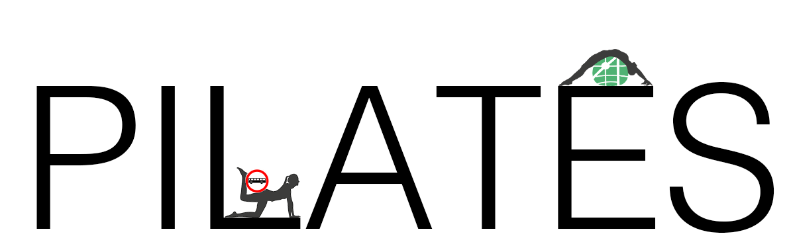
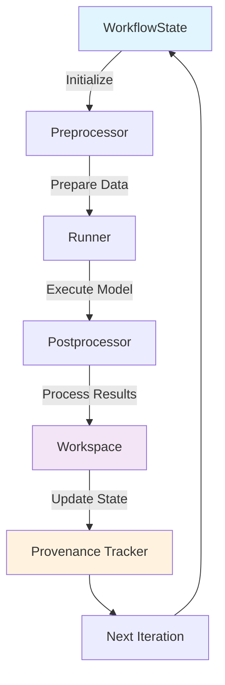

<p align="center"></p>

# PILATES

**Platform for Integrated Landuse And Transportation Experiments and Simulation**

PILATES is a containerized microsimulation framework that orchestrates multiple transportation and land use models to study long-term urban dynamics. It enables researchers and planners to simulate complex feedback loops between transportation systems, land use patterns, and technology adoption over decades.

## Why PILATES?

Traditional transportation models often operate in isolation, missing critical feedback loops between land use and transportation. PILATES solves this by orchestrating specialized models in containers, preserving their individual strengths while enabling integrated analysis.

**Key Benefits:**
- **Modular**: Leverage existing models (UrbanSim, ActivitySim, BEAM) without modification
- **Flexible**: Configure different model combinations and execution frequencies
- **Reproducible**: Complete provenance tracking and state management
- **Scalable**: Built for high-performance computing environments

## Supported Models

| Model | Purpose | Integration |
|-------|---------|-------------|
| **[UrbanSim](https://github.com/UDST/urbansim)** | Long-term land use evolution | Household/business location choices, real estate development |
| **[ATLAS](https://doi.org/10.1080/03081060.2024.2353784)** | Vehicle fleet dynamics | Fleet turnover, technology adoption (EV/ICE) |
| **[ActivitySim](https://github.com/ActivitySim/activitysim)** | Daily travel demand | Agent-based activity and travel pattern generation |
| **[BEAM](https://github.com/LBNL-UCB-STI/beam)** | Transportation network simulation | Traffic, transit, emerging mobility modes |

## Simulation Scenarios

PILATES supports multiple configuration levels:

1. **Network Analysis** (`BEAM only`) - Study infrastructure impacts with fixed demand
2. **Travel Demand** (`ActivitySim + BEAM`) - Standard agent-based model with feedback loops
3. **Land Use + Transport** (`UrbanSim + ActivitySim + BEAM`) - Long-term accessibility feedback
4. **Full Integration** (`UrbanSim + ATLAS + ActivitySim + BEAM`) - Complete urban system evolution

## Quick Start

### Prerequisites

- Docker or Singularity
- Anaconda/Miniconda

### Installation

```bash
# Clone and setup environment
git clone https://github.com/LBNL-UCB-STI/PILATES.git
cd PILATES
conda env create -f environment.yml
conda activate pilates
```

### Download Data

See [`lawrencium-setup.md`](lawrencium-setup.md#download-data) for data preparation instructions.

### Configure and Run

```bash
# Edit settings.yaml for your setup
# Set container_manager: "docker" or "singularity"
# Adjust region-specific parameters

# Run simulation (use -p flag for first run to pull containers)
python run.py -v -p
```

### Background Execution

```bash
# For long-running simulations
nohup python run.py -v &
```

## Architecture

PILATES uses a consistent preprocessor/runner/postprocessor pattern for model execution:



**Pattern Benefits:**
- **Modularity**: Independent component development and testing
- **Reproducibility**: Complete provenance tracking
- **Flexibility**: Easy model integration and customization

## HPC Usage

For cluster environments:

```bash
cd hpc
./job_runner.sh [options]
```

See [`lawrencium-setup.md`](lawrencium-setup.md) for detailed HPC setup instructions.

## Contributing

We welcome contributions! Please:

1. Fork the repository
2. Create a feature branch (`git checkout -b feature/amazing-feature`)
3. Commit changes (`git commit -m 'Add amazing feature'`)
4. Push to branch (`git push origin feature/amazing-feature`)
5. Open a Pull Request

**Report Issues:** [GitHub Issues](https://github.com/LBNL-UCB-STI/PILATES/issues)

**Guidelines:** See `CONTRIBUTING.md` (coming soon)

## Citation

```bibtex
@misc{pilates_2024,
  author = {Needell, Zachary and Waddell, Paul and Caicedo, Juan and 
            Laarabi, Haitam and Wang, Yuhan and Poliziani, Cristian and 
            Lazarus, Jessica and Openkov, Dmitrii and Gardner, Max and 
            Rezaei, Nazanin and others},
  title = {Platform for Integrated Land use And Transportation 
           Experiments and Simulation (PILATES) v1.0},
  doi = {10.11578/dc.20240613.2},
  url = {https://www.osti.gov/biblio/2373117},
  year = {2024},
  month = {05}
}
```

## License

MIT License. See [LICENSE](LICENSE) for details.
