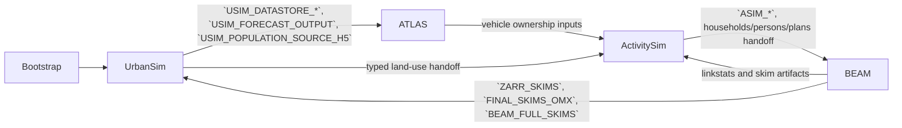

# Architecture

## What PILATES Does

PILATES assembles a run in `pilates/runtime/launcher.py`, then moves through a staged workflow with three main coordination objects:

- `WorkflowState` tracks year, stage, iteration, restart flags, and persisted progress.
- `EnabledWorkflowSurface` projects the active run shape from initialized runtime flags plus the current workflow state. It is the shared authority for enabled stages, enabled steps, restart-facing contracts, and required outputs.
- `Workspace` resolves filesystem locations for mutable model inputs, outputs, and archive roots.
- The coupler stores published artifacts that later steps can resolve without recomputing them.

The runtime keeps two handoff channels separate:

- `StepOutputsHolder` stores typed in-memory outputs between adjacent steps in the same process.
- The coupler stores published artifact values and is the runtime surface that survives step boundaries, cache recovery, and archive-aware replay.

## Data Flow

The outer year loop now advances through one computed schedule, then re-enters
this staged handoff chain for each forecast boundary.

## Core Layers

### Runtime assembly

`pilates/runtime/launcher.py` owns startup, runtime-flag initialization, `WorkflowState` restore/create, enabled-surface construction, restart preflight, bootstrap, Consist scenario setup, the yearly stage loop, and shutdown. It also builds the scenario contract, declares the coupler schema, and publishes bootstrap artifacts before the first major stage runs.

The launcher should stay model-agnostic. If you are adding behavior specific to
ATLAS, BEAM, ActivitySim, UrbanSim, or postprocessing, the right home is usually
the model package, a workflow step factory, binding, or the stage that owns that
boundary.

### Workflow catalog

`pilates/workflows/catalog.py` stores static `WorkflowStepSpec` entries. Those entries describe inputs, optional inputs, outputs, optional outputs, dependency edges, holder dependencies, dynamic key families, and provenance metadata. The catalog is static inspection data; it does not execute the models.

### Enabled workflow surface

The enabled workflow surface is a runtime projection that decides which stages
and steps are active for the current run, given settings-derived runtime flags
plus `WorkflowState`. `pilates/workflows/surface.py` turns those inputs and the
static catalog into one run-shape projection. Planning, binding, schema
filtering, restart preflight, and runtime output validation consume that surface
instead of rebuilding their own model-enablement views.

### Step factories

`pilates/workflows/steps/*.py` builds concrete step callables. Each factory binds a live coupler and outputs holder, calls the model component from `ModelFactory`, validates the returned typed outputs, and publishes the result into the holder and the coupler.

The step factory is the narrow execution seam between workflow policy and model
mechanics. It should make the boundary explicit without turning into another
stage loop.

### Typed outputs

`pilates/workflows/outputs_base.py` defines `StepOutputsBase` and the validation / RecordStore conversion rules for typed step outputs. A step outputs class declares which paths it stores, which record keys it publishes, and which semantic validators run after execution.

### Model adapters

`pilates/generic/model_factory.py` maps lowercased model names to preprocessor, runner, and postprocessor classes. The factory is the switch point between workflow orchestration and model-local logic.

Model adapter packages own model-local behavior: file preparation, model
execution, model-local callbacks, and interpretation of raw model outputs. They
should not decide global stage enablement or restart policy.

## Adjacent Pages

- Read [Workflow Primer](workflow_primer.md) for the workflow overview.
- Read [Model Boundaries](../reference/model_boundaries.md) for the per-model requirements and handoffs.
- Continue to [Stages and Steps](stages_and_steps.md) for execution units.
- Continue to [Step Contracts](step_contracts.md) for the contract layer.
- For implementation work, read [Model Integration Guide](../extend/model_integration_guide.md).

## Evidence Basis

- Runtime assembly and lifecycle: `pilates/runtime/launcher.py`
- Stage and progress tracking: `workflow_state.py`
- Filesystem layout: `pilates/workspace.py`
- Static step metadata: `pilates/workflows/catalog.py`
- Step factory shell and typed handoffs: `pilates/workflows/steps/shared.py`
- Model dispatch: `pilates/generic/model_factory.py`
- Contract validation and invariants: `tests/test_step_contract_validator.py`, `tests/test_workflow_invariants.py`, `tests/test_workflow_binding.py`, `tests/test_coupler_key_invariants.py`, `tests/test_golden_stub_workflow.py`
