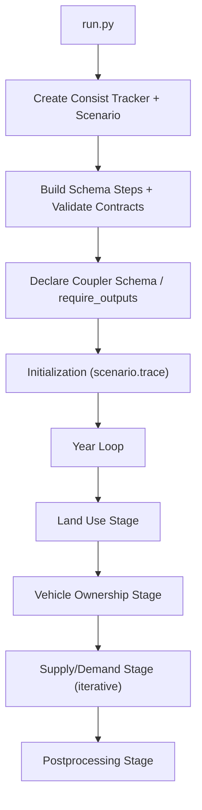

# PILATES Workflow Primer

This guide is a one-stop technical primer for new developers who need to
understand how PILATES defines:

- workflow stages
- workflow steps
- input/output contracts
- Consist lineage + caching/skip behavior

Use this with:

- `docs/adding_a_model.md` for integration steps
- `run.py` for the runtime entrypoint

## 1) Mental Model In 2 Minutes

PILATES orchestration has three layers:

1. **Stage layer**: high-level control flow (year loop, iteration loop, branching).
   Implemented in `pilates/workflows/stages/*.py`.
2. **Step layer**: model-specific execution units (preprocess/run/postprocess).
   Implemented in `pilates/workflows/steps/*.py`.
3. **Contract layer**: typed outputs, dependencies, schema membership, and
   provenance metadata. Implemented in:
   - `pilates/workflows/catalog.py`
   - `pilates/workflows/steps/shared.py`
   - `pilates/workflows/orchestration.py`
   - `pilates/workflows/outputs_base.py`

Think of it as:

- **Stages decide _when_ and _in what order_ work happens**
- **Steps decide _how_ work executes**
- **Contracts decide _what each step must consume/produce_**

**Why these layers exist:** In early PILATES, stages called model code directly
(e.g., `BeamPreprocessor._preprocess(...)`). That worked until we needed:
(a) caching -- skip expensive model runs when inputs haven't changed,
(b) provenance -- track what ran, with what config, producing what outputs,
(c) contract validation -- catch mismatched inputs/outputs at startup rather than
6 hours into a run, and (d) restart/resume -- pick up where a crashed run left off.
Each layer addresses one of these:

- **Consist** (`scenario.run`) handles caching and provenance recording
- **Step factories** (`_make_generic_step_function`) handle output typing, contract
  validation, and coupler publication
- **Stage modules** handle control flow, iteration loops, and restart logic
- **The catalog** handles structural consistency checking at startup

The key design boundary follows from this: the catalog defines _what steps exist_
and _what their contracts are_; stages define _how to orchestrate them_. Do not try
to encode stage control flow (loops, branching, convergence) in catalog metadata.
See Section 12 for more on this.

## 2) End-To-End Runtime Flow

At a high level, `run.py` does the following:

1. Parse config and initialize workflow state.
2. Create Consist tracker + scenario context.
3. Build schema steps and validate startup contracts.
4. Declare coupler output schema + required outputs.
5. Run initialization copy (if needed).
6. Run per-year stages in sequence:
   - land use
   - vehicle ownership
   - supply/demand loop
   - postprocessing



## 3) What A Stage Is

A **stage** is orchestration logic, not model logic.

Typical stage responsibilities:

- choose which steps to run
- resolve inputs for each step
- assemble `StepRef` objects
- call `run_workflow(...)` (or `run_manifested_steps(...)`)
- implement loops/branching/restart behavior

Examples:

- `pilates/workflows/stages/land_use.py`
- `pilates/workflows/stages/supply_demand.py`
- `pilates/workflows/stages/postprocessing.py`

Important boundary:

- Stage modules should orchestrate.
- Stage modules should not become ad hoc coupler mutation layers.
- Coupler read/write helpers are centralized in workflow/coupler helpers.

### 3.1 Concrete Example: A Land-Use Stage

This pattern from `pilates/workflows/stages/land_use.py` is representative:

```python
preprocess_steps = [
    StepRef(
        name="urbansim_preprocess",
        step_func=make_urbansim_preprocess_step(
            coupler=coupler,
            outputs_holder=outputs_holder_year,
        ),
        inputs=preprocess_resolution.stepref_inputs(),
        input_keys=preprocess_resolution.stepref_input_keys(),
    ),
]

run_workflow(
    stage_name="land_use",
    steps=preprocess_steps,
    scenario=scenario,
    state=state,
    settings=settings,
    workspace=workspace,
    coupler=coupler,
    outputs_holder=outputs_holder_year,
    name_suffix=str(year),
)
```

The logic here is:

1. resolve inputs
2. build typed `StepRef` invocation(s)
3. run through the common `run_workflow(...)` path
4. consume typed outputs from `StepOutputsHolder` for downstream logic

The stage controls flow; step factories control model execution details.

## 4) What A Step Is

A **step** is a decorated callable that Consist executes via `scenario.run(...)`.

In practice, step callables are created by factory functions such as:

- `make_urbansim_preprocess_step(...)`
- `make_activitysim_run_step(...)`
- `make_beam_postprocess_step(...)`

Most factories delegate to `_make_generic_step_function(...)` in
`pilates/workflows/steps/shared.py`, which standardizes:

1. component lookup via `ModelFactory`
2. component execution returning `RecordStore`
3. conversion to typed `StepOutputs`
4. output validation
5. provenance logging and coupler publication
6. storage in `StepOutputsHolder`
7. Consist metadata decoration (`define_step(...)`)

This is a major reason PILATES remains maintainable as step count grows.

### 4.1 End-To-End Trace: `beam_preprocess`

To see how all the layers connect, here is the full call chain for one step:

**1. Stage assembly** (`stages/supply_demand.py`):
The stage resolves inputs and creates an invocation spec:

```python
StepRef(
    name="beam_preprocess",
    step_func=make_beam_preprocess_step(coupler=coupler, outputs_holder=holder),
    inputs=resolved_beam_inputs,       # e.g. {plans_beam_in: ..., linkstats_warmstart: ...}
    input_keys=resolved_input_keys,
)
```

**2. Orchestration** (`orchestration.py:run_workflow`):
- Calls `validate_step_ready("beam_preprocess", outputs_holder)` -- checks that
  upstream dependency (`activitysim_postprocess`) is populated on the holder.
- Builds Consist kwargs via `_build_step_run_kwargs(...)` -- resolves year,
  iteration, cache options, output policy, and the canonical required outputs
  from `BeamPreprocessOutputs.declared_outputs`.
- Calls `scenario.run(**run_kwargs)`.

**3. Consist**:
Computes cache identity from code identity + step config + resolved inputs.
(`hash_inputs` are folded into config as digest entries.) If cache miss, calls
the step callable. If cache hit, returns cached result (and orchestration
attempts output recovery -- see Section 11.1).

**4. Step callable** (built by `make_beam_preprocess_step` in `steps/beam.py`):
This is the function Consist actually invokes. It was assembled by
`_make_generic_step_function(...)`, which runs this sequence:

  a. `ModelFactory.get_preprocessor("beam", state, ...)` -- returns a
     `BeamPreprocessor` instance.

  b. Calls the execute function with `(component, workspace, outputs_holder,
     coupler=..., context=..., **runtime_kwargs)` -- inside,
     `BeamPreprocessor._preprocess()` runs: copies plans/households/persons
     from ActivitySim output to the BEAM scenario directory, handles warm-start
     linkstats, returns a `RecordStore` containing `FileRecord` entries for
     each produced artifact.

  c. Converts `RecordStore` to `BeamPreprocessOutputs` (typed dataclass) via
     `record_store_to_outputs(...)`.

  d. Calls `outputs.validate()` -- checks path existence for required fields,
     then runs any semantic `OutputValidator`s attached to the class.

  e. Publishes artifacts to the coupler via the output logger (e.g.,
     `plans_beam_in`, `households_beam_in`, `persons_beam_in`).

  f. Stores the typed result: `outputs_holder.beam_preprocess = outputs`.

**5. Back in orchestration**: `run_workflow` advances to the next `StepRef`
(`beam_run`). Missing holder outputs are handled by cache-hit recovery and
downstream dependency checks; manifested paths also fail fast when outputs are
still missing.

The `RecordStore` is the key intermediate format: model code produces it
(a flat list of `FileRecord`s with short name, path, and description), and the
generic step function converts it to typed outputs and coupler entries. This is
what lets model implementations stay unaware of `StepOutputsBase`, the coupler, or
Consist.

## 5) StepRefs: How Stages Invoke Steps

Stages invoke steps through `StepRef`, defined in
`pilates/workflows/orchestration.py`.

`StepRef` captures runtime invocation details, including:

- step name and callable
- explicit inputs and/or input keys
- cache behavior (`cache_mode`, `cache_hydration`)
- output policy overrides (`output_missing`, `output_mismatch`)
- optional compatibility override (`required_outputs`, deprecated)

`run_workflow(...)` iterates `StepRef`s, builds Consist run kwargs, and executes
`scenario.run(...)`.

### 5.1 Concrete Example: Iterative Stage Invocation

In supply/demand, each iteration creates a stage-local `StepOutputsHolder` and
repeats ActivitySim and BEAM phases. Conceptually:

```python
for i in range(state.iteration, total_iters):
    outputs_holder = StepOutputsHolder()
    manifest_config = ManifestConfig(path=build_manifest_path(workspace, year, i))

    activity_steps = [...]
    run_manifested_steps(..., steps=activity_steps, outputs_holder=outputs_holder)

    beam_steps = [...]
    run_manifested_steps(..., steps=beam_steps, outputs_holder=outputs_holder)
```

This gives you:

- iteration isolation in memory (`outputs_holder`)
- checkpoint/restart semantics (manifest)
- consistent Consist execution path per step

## 6) The Contract System

### 6.1 Workflow Catalog Is The Source Of Truth

`pilates/workflows/catalog.py` defines `WorkflowStepSpec` entries for each step.

Key fields include:

- `step_name`, `model_name`, `phase`
- `stage_name`, `order`
- `outputs_class`
- `depends_on`, `holder_inputs`
- `enabled_flag_attr`, `enabled_model_attr`
- optional provenance metadata (`WorkflowStepProvenanceSpec`)

From this catalog, PILATES derives runtime maps such as:

- schema step names
- tracked outputs classes
- dependency maps
- enabled model sets for schema filtering

This prevents drift from manually-maintained parallel registries.
`STEP_OUTPUTS_CLASSES` and `STEP_DEPENDENCIES` are now derived from the catalog
at import time (via `step_outputs_classes_from_catalog()` and
`step_dependencies_from_catalog()` in `shared.py`). `StepOutputsHolder` fields
and the factory map in `run.py::_build_schema_steps()` are still manually
maintained but validated against the catalog at startup.

Concrete example entry (shape only):

```python
WorkflowStepSpec(
    step_name="beam_run",
    model_name="beam_run",
    phase="run",
    stage_name="traffic_assignment",
    order=120,
    outputs_class=BeamRunOutputs,
    depends_on=("beam_preprocess",),
    holder_inputs=("beam_preprocess",),
    enabled_flag_attr="traffic_assignment_enabled",
    enabled_model_attr="travel",
    provenance=_BEAM_PROVENANCE,
)
```

From this one entry, PILATES can derive:

- execution ordering in schema builds
- tracked output class mapping
- dependency readiness expectations
- enablement behavior
- provenance builder key (through `provenance`)

### 6.2 Canonical Output Contract

For tracked steps, the canonical required-output contract is:

- `StepOutputsBase.declared_outputs`

`define_step(outputs=...)` metadata is derived from that canonical source.

`StepRef.required_outputs` exists only as a narrow compatibility escape hatch
and now requires `required_outputs_rationale`.

### 6.3 Strict Output Policy By Default

When a step has required outputs, orchestration applies strict defaults unless
explicitly overridden:

- `output_missing="error"`
- `output_mismatch="error"`

That means contract drift fails fast.

### 6.4 Startup Contract Validation

`validate_workflow_step_contracts(...)` catches integration drift early:

- holder fields vs outputs classes mismatch
- outputs classes vs dependency map mismatch
- invalid dependency references
- declared step set mismatch
- canonical-vs-metadata output contract conflicts
- deprecated override without rationale

This runs at startup and again at stage execution boundaries.

Concrete conflict example:

- canonical output keys from `BeamRunOutputs.declared_outputs`:
  `["linkstats", "beam_plans_out"]`
- metadata keys from a mismatched `define_step(outputs=[...])`:
  `["beam_linkstats"]`

Result: startup failure with an actionable error before expensive runs begin.

## 7) Input and Output Handoff Channels

**What the coupler is:** A key-value store scoped to a Consist scenario. Steps
publish artifacts to it by key (e.g., `"households_asim_in"` maps to
`/path/to/households.csv`), and downstream steps read from it by key. Think of it
as a runtime registry that replaces hardcoded path assumptions -- instead of BEAM
knowing that ActivitySim writes to `activitysim/output/households.csv`, BEAM asks
the coupler for `"households_beam_in"` and gets whatever path the upstream
postprocessor published. The coupler is accessed as `scenario.coupler` after
entering `cr.scenario(...)` in `run.py` and lives for the duration of the
scenario. Canonical artifact keys
are defined in `pilates/workflows/artifact_keys.py`.

PILATES uses three complementary handoff mechanisms:

1. `StepOutputsHolder`:
   - typed in-memory handoff within orchestration runtime
   - supports dependency readiness checks (`validate_step_ready`)
2. Coupler:
   - cross-step artifact exchange keyed by canonical artifact keys
   - declared schema is built in `run.py` and enforced through Consist
3. Manifest (optional, stage-dependent):
   - per-step checkpoint file for restart/skip in manifested paths
   - used heavily in supply/demand iteration flows

### 7.1 Worked Handoff Example (ActivitySim -> BEAM)

One common handoff path looks like:

1. `activitysim_postprocess` publishes coupler artifacts:
   `beam_plans_asim_out`, `households_asim_out`, `persons_asim_out`
2. `beam_preprocess` resolves those as inputs and writes:
   `plans_beam_in`, `households_beam_in`, `persons_beam_in`
3. `beam_run` writes traffic outputs: `linkstats_{y}_{i}`, `raw_od_skims_{y}_{i}`
4. `beam_postprocess` produces `zarr_skims` / `final_skims_omx` consumed by
   ActivitySim on the next iteration

The same data may be represented in all three channels:

- typed in `StepOutputsHolder` (e.g., `outputs_holder.beam_preprocess.prepared_inputs`)
- coupler keys for cross-step resolution (e.g., coupler key `"plans_beam_in"`)
- manifest serialization for restart (serialized `BeamPreprocessOutputs` dict)

### 7.2 Data Flow Diagram (One Supply/Demand Iteration)

```
UrbanSim H5 ──[usim_datastore_h5]──→ ActivitySim Preprocess
                                          │
                              ┌───────────┼───────────┐
                              ↓           ↓           ↓
                    [land_use_asim_in] [households_asim_in] [persons_asim_in]
                              │           │           │
                              └───────────┼───────────┘
                                          ↓
                                   ActivitySim Run
                                          │
                              [beam_plans_asim_out, households_asim_out, ...]
                                          ↓
                                ActivitySim Postprocess
                                          │
                              [plans, households, persons → normalized]
                                          ↓
                                   BEAM Preprocess
                                          │
                    [plans_beam_in, households_beam_in, persons_beam_in]
                                          ↓
                                      BEAM Run
                                          │
                           [linkstats_{y}_{i}, raw_od_skims_{y}_{i}]
                                          ↓
                                   BEAM Postprocess
                                          │
                             [zarr_skims, final_skims_omx]
                                          │
                              (feeds back to next iteration
                               as skims input for ActivitySim)
```

Artifact key names in brackets correspond to keys in
`pilates/workflows/artifact_keys.py` and coupler entries.

## 8) Input Resolution Precedence

When stages resolve inputs, they use `resolve_step_inputs(...)` and related
helpers from `pilates/workflows/input_resolution.py`.

Per-key precedence is:

1. explicit input
2. coupler value
3. fallback input

This keeps input behavior deterministic and auditable.

Concrete logic example for one key (say `usim_datastore_h5`):

1. if stage passed explicit value, use it
2. else if coupler has key, use coupler value
3. else if fallback mapping has key, use fallback
4. else mark as missing required and fail fast (if required)

## 9) StepOutputs and Validation

Each tracked step has a typed outputs class (e.g., `BeamRunOutputs`) derived
from `StepOutputsBase`.

`StepOutputsBase.validate(...)` performs:

1. structural path existence checks:
   - required fields
   - optional fields (when present)
   - dict-path fields
2. semantic validator checks via pluggable `OutputValidator`s

Semantic validation uses `ValidationContext`, which can include:

- settings
- state
- workspace
- step_name
- upstream outputs view

This enables progressively stronger scientific guardrails without tightly
coupling model code to orchestration internals.

### 9.1 Concrete Outputs Class Example

```python
@dataclass
class BeamRunOutputs(StepOutputsBase):
    primary_output_attr = "beam_output_dir"
    declared_outputs = ("linkstats", "beam_plans_out")
    required_path_fields = ("beam_output_dir",)
    dict_path_fields = ("raw_outputs",)
```

Interpretation:

- this step must at minimum produce a valid `beam_output_dir`
- canonical contract keys for orchestration are `linkstats` and `beam_plans_out`
- additional raw keys can still be logged/kept for diagnostics

### 9.2 Minimal Semantic Validator Pattern

```python
class ExampleValidator:
    name = "no_empty_table"
    level: ValidationLevel = "error"

    def validate(self, outputs, context):
        if outputs.some_path.stat().st_size == 0:
            return [ValidationResult("some_path is empty")]
        return []
```

Attach via:

- `validators: ClassVar[Tuple[OutputValidator, ...]] = (ExampleValidator(),)`

Then `_make_generic_step_function(...)` calls `step_outputs.validate(...)` with
runtime context, including upstream outputs.

## 10) How Consist Is Used

PILATES uses Consist in four key ways:

1. **Scenario lifecycle**
   - `run.py` opens `cr.scenario(...)`
2. **Step execution**
   - stages call `scenario.run(...)` through `run_workflow(...)`
3. **Lineage metadata**
   - step callables are decorated with Consist metadata
   - step config/facet/hash inputs come from `build_step_consist_kwargs(...)`
4. **Caching/skip behavior**
   - Consist cache hits can skip execution for identical signatures

**What `scenario.run(fn=step_func, ...)` does under the hood:**

1. Computes a cache identity from code identity + `config` + resolved inputs
   (with `hash_inputs` included as config digests).
2. Checks if an identical execution already exists in the Consist store.
3. If cache hit: returns the cached result _without calling `step_func`_. The step
   callable never runs.
4. If cache miss: calls `step_func(**runtime_kwargs)`, records its declared outputs,
   and stores the result for future cache hits.

This is why steps must be decorated with `@define_step` -- Consist needs the
metadata to compute identity and track outputs. It is also why cache hit recovery
exists (Section 11.1): when a step is skipped, the in-memory `StepOutputsHolder`
is empty because the step callable never ran, so orchestration must reconstruct
outputs from cached payload, the coupler, or known filesystem locations.

### 10.1 Provenance Config/Facet/Hash Inputs

`pilates/utils/consist_config.py` builds per-step Consist kwargs:

- `config` (cache identity)
- `facet` (queryable metadata)
- `hash_inputs` (file/dir digests folded into identity)
- `facet_schema_version`

Builder dispatch is catalog-aware:

- `WorkflowStepProvenanceSpec.builder_key` controls which model-family builder
  is used when present
- fallback dispatch by model prefix still exists for compatibility

`pilates/workflows/step_consist_meta.py` wires this into step metadata callables
consumed at runtime.

### 10.2 Concrete Signature Logic Example

For a step like `beam_run`, identity and lineage typically combine:

1. `config`:
   - execution-governing settings (model config knobs)
2. `hash_inputs`:
   - selected files/dirs folded into identity
3. `facet`:
   - queryable metadata for debugging/search, not identity

If identity-equivalent inputs are seen again, Consist can return a cache hit.

## 11) Caching, Skipping, and Recovery Behavior

There are two skip layers:

1. **Consist cache hit** (`scenario.run(...)`)
2. **Manifest skip** (`run_manifested_steps(...)`, when stage uses a manifest)

### 11.1 Cache Hit Recovery

If Consist reports `cache_hit=True` and the step did not repopulate
`StepOutputsHolder`, orchestration attempts best-effort output recovery from:

- cached outputs payload
- coupler
- known artifact recovery rules

If recovery still fails, PILATES reruns with `cache_mode="overwrite"` to keep
execution correctness over cache purity.

### 11.2 Manifest Skip

In manifested paths (notably supply/demand loops), completed steps can be
skipped if manifest outputs are still valid.

Before skipping, stale output detection validates serialized outputs; stale
entries are invalidated and rerun.

### 11.3 Initialization Skip

`run.py` skips data initialization on restart when state indicates it is already
complete.

### 11.4 Worked Scenarios

Scenario A: cache hit, outputs recoverable

1. `scenario.run(...)` returns `cache_hit=True`
2. orchestration recovers outputs from cached payload/coupler
3. step is not rerun

Scenario B: cache hit, outputs not recoverable

1. `scenario.run(...)` returns `cache_hit=True`
2. recovery fails to hydrate `StepOutputsHolder`
3. orchestration reruns with `cache_mode="overwrite"`
4. if still missing, stage fails fast

Scenario C: manifested resume

1. manifest says step completed
2. serialized outputs validate and hydrate
3. step is skipped
4. if stale/missing, manifest entry is invalidated and step reruns

## 12) Catalog vs Stage: The Most Important Design Boundary

Catalog defines:

- what steps exist
- contracts and dependencies
- schema inclusion and enablement metadata

Stage modules define:

- full execution control flow
- loops, branch conditions, convergence behavior
- manifest strategy for restart/skip

Do not try to encode full stage control flow in catalog metadata.

## 13) Common Failure Modes and Where To Look

1. `Workflow step contract validation failed`
   - check `pilates/workflows/steps/shared.py`
   - inspect holder/output/dependency/catalog consistency
2. `required_outputs override requires rationale`
   - add `required_outputs_rationale` or remove override
   - check `StepRef` usage in stage modules
3. `did not populate outputs_holder`
   - check step factory output setter and `record_store -> StepOutputs` conversion
4. unexpected missing coupler output
   - confirm artifact key declaration + output logger behavior
   - inspect coupler schema and required output construction in `run.py`
5. cache hit but no usable outputs
   - inspect recovery path in `pilates/workflows/orchestration.py`
   - verify step output reconstruction logic

## 14) Where New Developers Should Start

Recommended reading order:

1. this guide (`docs/workflow_primer.md`)
2. `run.py`
3. `pilates/workflows/catalog.py`
4. one simple stage module (`pilates/workflows/stages/land_use.py`)
5. one iterative stage module (`pilates/workflows/stages/supply_demand.py`)
6. `pilates/workflows/steps/shared.py`
7. `docs/adding_a_model.md`

If your goal is adding a new model, move next to:

- `docs/adding_a_model.md`
- `scripts/new_model_scaffold.py`

## 15) Glossary (Quick Reference)

- **Stage**: orchestration control-flow unit (often many steps).
- **Step**: executable Consist-decorated callable (usually preprocess/run/postprocess).
- **StepRef**: stage-side invocation spec for one step run.
- **Workflow catalog**: declarative registry of step contracts and metadata.
- **StepOutputs**: typed output dataclass for a tracked step.
- **StepOutputsHolder**: in-memory typed handoff store between steps.
- **Coupler**: key-value store scoped to a Consist scenario. Steps publish
  artifacts by key (e.g., `"households_asim_in"` to a file path) and downstream
  steps read by key. Replaces hardcoded path assumptions between models.
  Accessed as `scenario.coupler` after entering `cr.scenario(...)` in `run.py`.
- **RecordStore**: flat list of `FileRecord` entries (short name, path,
  description). The intermediate format between model execution and typed
  outputs -- model code produces a `RecordStore`, and the generic step function
  converts it to a `StepOutputsBase` subclass and coupler entries.
- **ModelFactory**: component registry (`pilates/generic/model_factory.py`) that
  maps model names to preprocessor/runner/postprocessor classes. Step factories
  call `factory.get_preprocessor("beam", ...)` etc. to get model instances.
- **Manifest**: restart/checkpoint record of completed manifested steps.
- **Facet**: query metadata for provenance (not cache identity).
- **Hash inputs**: explicit path digests folded into cache identity.
- **Artifact keys**: canonical string constants (`pilates/workflows/artifact_keys.py`)
  that name data artifacts exchanged via the coupler (e.g., `ASIM_HOUSEHOLDS_IN`,
  `BEAM_PLANS_IN`, `USIM_DATASTORE_CURRENT_H5`).
