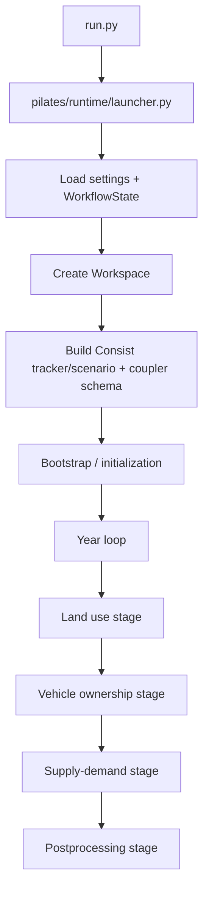

# PILATES Workflow Primer

This guide is the onboarding primer for developers who need to understand how
the current PILATES runtime actually works.

It focuses on the workflow as it exists in this repository today:

- the thin CLI entrypoint in `run.py`
- runtime assembly in `pilates/runtime/launcher.py`
- stage orchestration in `pilates/workflows/stages/`
- step execution in `pilates/workflows/steps/`
- typed output contracts, coupler publication, and restart behavior

Use it with:

- `docs/model_integration_guide.md` for architecture and extension points
- `docs/adding_a_model.md` for the implementation checklist

## Mental Model In 2 Minutes

PILATES has four practical workflow layers:

1. Runtime layer
   `run.py` and `pilates/runtime/launcher.py`
2. Stage layer
   `pilates/workflows/stages/*.py`
3. Step layer
   `pilates/workflows/steps/*.py`
4. Contract layer
   `pilates/workflows/catalog.py`, `pilates/workflows/steps/shared.py`,
   `pilates/workflows/outputs_base.py`, and `pilates/workflows/orchestration.py`

The rule of thumb is:

- runtime owns lifecycle
- stages own control flow
- steps own execution
- typed outputs own the contract

If you keep those boundaries straight, the codebase becomes much easier to
understand.

## End-To-End Runtime Flow

Today, `run.py` is intentionally thin. It delegates to
`pilates/runtime/launcher.py`.

At a high level, the launcher does this:

1. Parse CLI args and load validated settings.
2. Build `WorkflowState`.
3. Initialize `Workspace`.
4. Build the Consist scenario runtime contract and coupler schema.
5. Run bootstrap/initialization if needed.
6. Run the enabled stages for each modeled year.
7. Persist restart metadata and archive-ready artifacts along the way.

The important update from older docs is that the workflow is no longer centered
on a large `run.py` script. The runtime assembly lives in
`pilates/runtime/launcher.py`.

## Stage Order And State

`WorkflowState` tracks the current year, major stage, inner iteration, and
sub-stage progress.

The major stages are:

- `land_use`
- `vehicle_ownership_model`
- `supply_demand_loop`
- `postprocessing`

Inside the supply-demand loop, the substages are:

- `activity_demand`
- `activity_demand_directly_from_land_use`
- `traffic_assignment`

Which stages run depends on the configured models and flags computed from the
loaded settings.

## What The Workspace Does

`pilates/workspace.py` owns the run-local filesystem layout.

It provides canonical paths such as:

- UrbanSim mutable data dir
- ActivitySim mutable data/config/output dirs
- BEAM mutable data/output dirs
- ATLAS mutable input/output dirs

When integrating or debugging models, use `Workspace` path getters rather than
assuming a current working directory. This matters even more for containerized
steps and restart runs.

## What A Stage Actually Is

A stage is orchestration code for one part of the simulation.

Examples:

- `pilates/workflows/stages/land_use.py`
- `pilates/workflows/stages/vehicle_ownership.py`
- `pilates/workflows/stages/supply_demand.py`
- `pilates/workflows/stages/postprocessing.py`

Typical stage responsibilities:

- resolve step inputs
- build coupler bindings
- assemble `StepRef`s
- choose manifest locations
- run steps through `StageRunner` / `run_workflow(...)`
- manage loops and restart-sensitive control flow

Stages should not contain model implementation logic. They coordinate model
steps; they do not replace them.

## What A Step Actually Is

A step is a Consist-decorated callable created by a step factory.

Examples:

- `make_urbansim_preprocess_step(...)`
- `make_activitysim_run_step(...)`
- `make_beam_postprocess_step(...)`

The step layer is where PILATES turns model components into workflow-aware
execution units.

Typical step-factory responsibilities:

1. resolve a component from `ModelFactory`
2. fetch typed upstream outputs from `StepOutputsHolder`
3. call the component public method
4. validate typed outputs
5. publish workflow-facing artifacts to the coupler
6. store outputs on `StepOutputsHolder`
7. expose recovery or replay hooks when needed

Most tracked typed steps now follow the standard builder path:

- model-local `make_*_step(...)` factory
- `StandardStepSpec`
- `build_standard_step(...)`

That builder is intentionally narrow. It removes repeated wrapper plumbing, but
logging policy, warm-start behavior, replay hooks, and recovery behavior still
live in the model-specific step module.

The main current references are:

- `pilates/workflows/steps/activitysim.py`
- `pilates/workflows/steps/beam.py`
- `pilates/workflows/steps/urbansim_atlas.py`
- `pilates/workflows/steps/postprocessing.py`

## `StepRef`: How Stages Invoke Steps

Stages do not call model components directly. They assemble `StepRef`s and pass
them to orchestration helpers.

`StepRef` in `pilates/workflows/orchestration.py` captures the runtime details
for one invocation, including:

- step name
- callable
- explicit inputs or binding
- output path providers
- replay/recovery hooks
- cache and output-policy overrides
- model/year/iteration metadata

This lets the orchestration layer execute steps consistently and attach the
right runtime metadata.

## Schema Steps Are Built Separately

PILATES also builds a schema-validation view of the workflow during startup.

That path uses:

- `schema_step_names()` from `pilates/workflows/catalog.py`
- `SCHEMA_STEP_BUILDERS` / `schema_step_builder_registry()` from
  `pilates/workflows/steps/__init__.py`
- `build_schema_steps()` in `pilates/runtime/scenario_runtime.py`

Those schema steps are intentionally separate instances from runtime steps:

- schema steps use `SchemaCoupler`
- runtime steps use the live workflow coupler

That separation lets PILATES validate contracts and declare schema surfaces
without accidentally reusing execution-time step instances.

## The Contract Layer

The contract layer keeps the workflow honest.

The most important pieces are:

- `WorkflowStepSpec` entries in `pilates/workflows/catalog.py`
- `StepOutputsBase` in `pilates/workflows/outputs_base.py`
- `StepOutputsHolder` in `pilates/workflows/steps/shared.py`
- startup/runtime validation in `validate_workflow_step_contracts(...)`

This layer defines:

- what tracked steps exist
- what each step expects
- what each step produces
- what runtime dependencies must already be satisfied

It is the main reason integration drift gets caught before an expensive run is
hours deep.

One current detail that matters for readers of the catalog:

- `step_name` is the canonical tracked-step identity
- some compatibility helpers still use "model name" terminology, but for
  tracked catalog steps that now aliases to `step_name`

## Typed Outputs And `StepOutputsHolder`

Typed outputs are the main handoff object between steps.

`StepOutputsHolder` keeps one in-memory slot per tracked step, for example:

- `activitysim_preprocess`
- `activitysim_run`
- `beam_run`
- `urbansim_postprocess`
- `atlas_postprocess`

This gives downstream steps a typed upstream contract without forcing them to
rebuild state from the filesystem or the coupler.

The holder is also used by dependency checks such as `validate_step_ready(...)`.

## Coupler: What It Is For

The coupler is the workflow-wide artifact namespace.

Use it for artifacts that must be available across step boundaries, stage
boundaries, or restart boundaries.

Examples in the current workflow:

- canonical UrbanSim datastore handoffs
- ActivitySim handoff tables
- BEAM warm-start linkstats
- final skims artifacts
- durable manifests and archive-copied outputs

Do not treat the coupler as a generic dump of internal model state. If an
artifact is not a real workflow-facing contract, it probably should not live
there.

## Bootstrap And Initialization

Bootstrap is handled separately from the main year/stage loop in
`pilates/runtime/bootstrap.py`.

That phase:

- runs initialization
- supports bootstrap cache hits
- materializes cached bootstrap outputs into the workspace when possible
- seeds bootstrap-safe artifacts into the coupler

This is important because later stages may assume those inputs already exist
even on a resumed run.

## Restart And Resume

Restart is a first-class workflow concern.

Key pieces:

- `WorkflowState` persists restartable progress
- manifests are written under `.workflow/`
- cache recovery lives in the orchestration/runtime layers
- stage modules contain resume-specific fallback logic where necessary

Examples in the current code:

- land-use stage manifesting per year
- supply-demand manifests per year and iteration
- resume helpers in `pilates/workflows/stages/supply_demand_resume.py`

Implication for developers:

If a step relies on undocumented in-memory side effects, it will likely fail on
resume. Typed outputs and coupler publication should be enough to reconstruct
the workflow boundary.

## The Supply-Demand Loop

The supply-demand stage is the most complex orchestration surface in the repo.

At a high level, each outer iteration does:

1. Activity-demand phase
   usually ActivitySim preprocess -> compile once per year -> run ->
   postprocess
2. Traffic-assignment phase
   usually BEAM preprocess -> run -> postprocess
3. Boundary durability and optional convergence handling

The loop uses:

- `WorkflowState.iteration`
- a fresh `StepOutputsHolder` per iteration
- manifest checkpoints
- coupler-published warm-start artifacts

Understanding this loop is the fastest way to understand why PILATES needs a
stage layer instead of only model components.

## Containers And Lineage

Containerized models run through `GenericRunner.run_container(...)`.

That path delegates to Consist's container integration when possible and falls
back to direct execution only when necessary.

Practical implications:

- mounts matter
- output paths matter
- lineage mode may differ by model
- relative-path assumptions are risky

When documenting or extending a containerized model, describe the workspace
paths and artifact handoffs explicitly.

## What New Developers Should Read In Order

If you are onboarding to the workflow code, read in this order:

1. `run.py`
2. `pilates/runtime/launcher.py`
3. `workflow_state.py`
4. one stage module, usually `pilates/workflows/stages/land_use.py`
5. one step module, usually `pilates/workflows/steps/activitysim.py`
6. the corresponding outputs module, such as `pilates/activitysim/outputs.py`
7. `pilates/workflows/catalog.py`
8. `pilates/workflows/steps/shared.py`

That path gives you the runtime, orchestration, and contract layers in a
manageable order.

## Common Misreadings Of The Current Design

- `run.py` is not the main orchestration implementation anymore.
- The workflow is not centered on raw `RecordStore` contracts.
- Stage modules are not interchangeable with step modules.
- `StepOutputsHolder` is not just convenience state; it is part of the runtime
  contract.
- Restart support is not an afterthought; it shapes the workflow interfaces.

## Practical Debugging Tips

- If a step cannot find upstream data, inspect both `StepOutputsHolder` wiring
  and coupler publication.
- If a restart behaves differently from a fresh run, inspect manifests and
  cache-recovery assumptions first.
- If a model runs but downstream stages fail, check the typed outputs contract
  before touching stage logic.
- If container outputs are missing, verify workspace-derived paths and mount
  coverage before debugging model internals.
